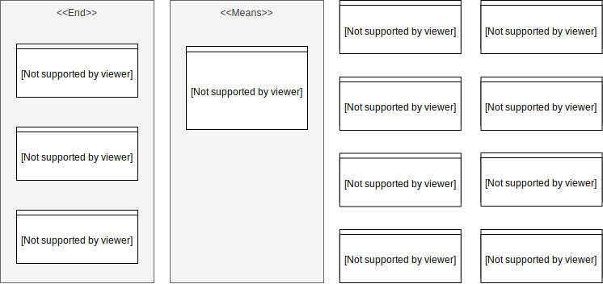

This document describes the vision and business processes in the context of a fictional company which aims to be eco-friendly.

## BMM
The vision of our company is to reduce paper waste by digitalizing as many internal processes as possible.

To further our goal, we will commission a software system for managing our customer data, contact persons and invoices.

## BPMN
We are targeting the invoicing business process, one of the core financial processes of any company.

## Architecture
### Components
Our software system will consist of two servers:

 - The `manager`, which is a Java application that exposes a RESTful API and also serves the user interface.
 - The `generator`, which is a NodeJS worker that generates Microsoft Word files based on pre-existing templates. 

In addition to these servers, we employ three backing services:

 - A [PostgreSQL](https://www.postgresql.org/) database for storing all relational data.
 - A [MongoDB](https://www.mongodb.com/) database acting as a document store for temporarily holding
 - A [RabbitMQ](https://www.rabbitmq.com/) message broker serving as a communication channel between the two servers.

### Deployment
The system is deployed on Docker, each server and each backing service having its own container with the appropriate links between each other.

### The Manager
The manager is a Spring Boot based server which has the following responsibilities:

 - Handling the persistence of the business data.
 - Exposing this data through a RESTful API.
 - Securing the application through a form based authentication mechanism.
 - Communicating with the `generator` via the queue.
 - Collecting results from the `generator` and creating ZIP archives if necessary (if multiple invoices are exported at once).
 - Tracking the generation jobs' status.
 - Exposing the generated documents from the MongoDB collection.

This server cannot be easily scaled horizontally, due to the fact that it uses an in-memory storage for the session data and job status.

### The Generator
The generator is a very small NodeJS worker application which:

 - Listens for work packages on the queue.
 - Generates a Word document for each work package by combining the data from the work package with the invoice template.
 - Save the document inside MongoDB and uses the built-in TTL feature to set an expiration date and time (such that the generated documents are not persisted indefinitely).

This application can be scaled horizontally, allowing for faster throughput.

### Data Model

### Download Sequence
One of the most complex sequences in the system occurs when an invoice is rendered into a Word document, because it involves all components. It consists of the following steps:

 - The `user` indicates that he wishes for a invoice to be exported by clicking the *download* button on the `UI`.
 - The `UI` sends an AJAX request to the `manager` with the ID of the invoice to be exported.
 - The `manager` loads the invoice from the `PostgreSQL`, computes all the transient information for the invoice (e.g. the totals) and then pushes a work package onto the `RabbitMQ`.
 - The `manager` also creates a new Job entry in-memory and exposes it's status to the `UI` (which is periodically polling for status updates).
 - The `RabbitMQ` notifies the `generator` when available about a new work package.
 - The `generator` processes this work package, saves the result into the `MongoDB` and then pushes a result message onto the `RabbitMQ`.
 - The `manager` receives the result message and updates the Job status accordingly.
 - The `UI` receives the status update as well (via the polling mechanism) and requests to download the file by calling a dedicated API.
 - The `manager` processes the download request, loads the document from the `MongoDB` and sends it to the `UI`.

## Patterns

 - Polling consumer: the `UI` polls the `manager` regularly to get Job status updates.
 - Event-driven consumer: the `manager` consumes the result messages from `RabbitMQ` and updates the Job status as soon as available.
 - Competing consumer: if the `generator` is scaled horizontally, the messages will be dispatched to each instance in a round robin fashion. 
 - Scatter-gather: when multiple documents are exported at once, the `manager` pushes (*scatters*) N work packages onto the `RabbitMQ`, the `generator` processes each of them separately, thus generating N result messages and finally the `manager` aggregates (*gathers*) all N results and generates a single ZIP file out of all of the corresponding documents.
 - Message channel: the `manager` and the `generator` are linked via a simple work queue (*message channel*).